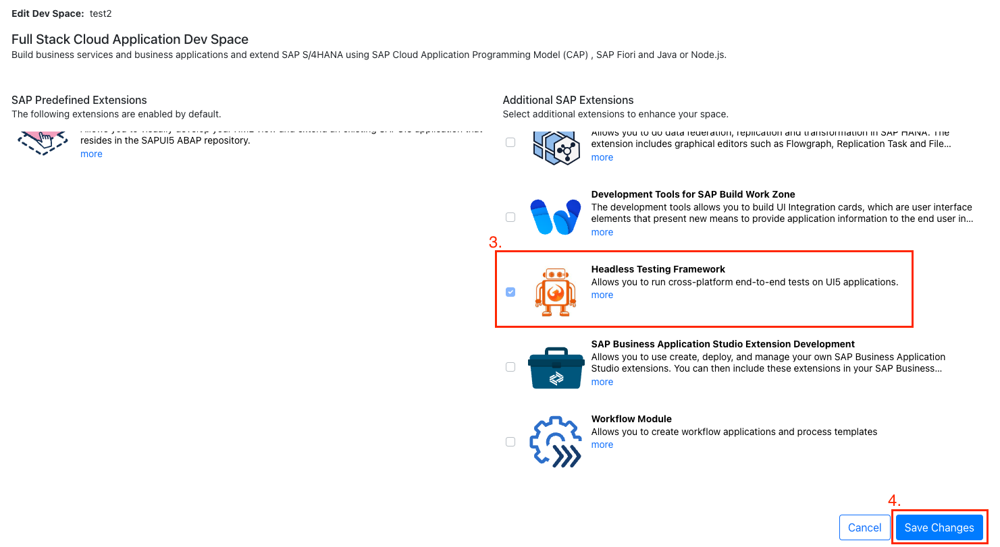
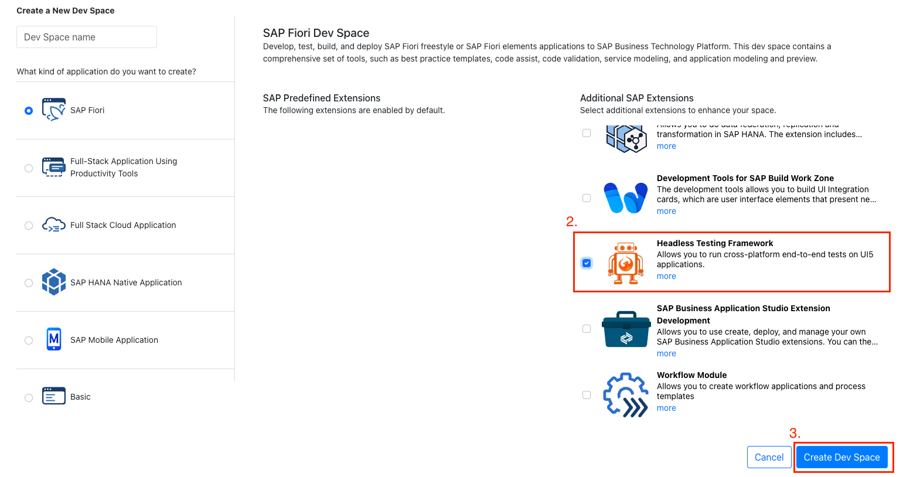

# WDI5 Training with Samples

This project contains a very simple UI5 app for the purpose of demonstrating WDI5 functionalities
and best practices.

The project was generated with `cds init`, so it follows the industry standard.
The UI5 app was generated with yeoman's `Easy UI5 Generator`, which can easily be installed with: 
`npm install -g yo generator-easy-ui5`

## What is WDI5?
WDI5 is a UI5 extension to the popular Web Driver IO or WDIO for short.
WDIO is one of the more popular ways of automated manipulation on the DOM of a website.
So in essence, WDI5 is just a robot you can program to interact with your UI5 webapp, 
hence automating otherwise repeatative tasks such as continuous manual testing...

## When to use WDI5?
WDI5 is not meant to cover every possible interaction imaginable in your app.
It is meant to test the important paths, that your app needs to function.

For example:
A form does not need to have every input filled out to verify whether the form can be modified and saved.
But if it is very important to upload a file to said form, then maybe include that...


## Getting Started with this Project
To get the UI5 app up and running, simply navigate to the app folder using `cd app`,
quickly install all dependecies with `npm i`,
and start the app using `npm run start`.

## The WDI5 Samples
In the `./app/webapp/test/e2e` folder, you will find the included samples.
The samples is meant to demonstrate how to use `Locators` and `Expectors`.
There is both examples of how to write the Selector/Locator in-file, but best practice is to keep Locators and the tests separate to keep the tests readable.

The last example is not correct, and will throw an error - you should correct it!

### Running the samples
To run the included samples, in a terminal in the app folder, simply run 
```sh
npm run wdi5
```

### The SelectorTemplate
In the `.vscode` folder I have included a template to make it easier to create WDI5 Selectors/Locators.
Simply writing `wdi5` a `wdi5SelectorTemplate` option will pop up and upon choosing it, scaffolding for a Locator will be created.
Just enter the name of the Locator and add the Selector below.


## Useful WDI5 Commands
Will run all tests in e2e folder:
```sh
npm run wdi5
```

Will run all tests in e2e folder, and will run again after each save:
```sh
npm run wdi5 -- --watch
```
Above command is useful for continuous development and testing.

Same as `--watch` but allows for breakpoints in the IDE, if run from the `JavaScript Debug Terminal`, for ease of debugging.
```sh
npm run wdi5 -- --watch --debug
```


## Adding WDI5 to an Existing Project
Navigate to your app folder and run:
```sh
npm init wdi5@latest -- --ts 
```
If you are not writing in TypeScript (you should), then just omit the `-- --ts`

Otherwise, WDI5 now also comes as standard with the `Easy UI5 Generator`


## Using WDI5 in BAS
The documentation, which the following steps are based on, can be found [here](https://ui5-community.github.io/wdi5/#/usage?id=using-bas-with-wdi5).

If you are using this repo, there is a branch called `BAS_Setup`, which have the project side set up.
To switch branch use command: 
```sh
git checkout BAS_Setup
```

To enable WDI5 for BAS, you need to enable an `Additional Extension`.
### Do the following to add it to an existing Dev Space:


1. Make sure the Dev Space is STOPPED!
2. Edit the Dev Space.



3. Scroll to the bottom and select `Headless Testing Framework`.
4. Save changes.

If you are setting up your own project, make sure your `wdio.conf.t|js` and `package.json` is aligned with the documentation linked above.
Alternatively, copy this project's `wdio.conf.ts` file into your own project, and make sure to include `"wdio-geckodriver-service": "^5.0.2"`in your `package.json`, along with the other required packages mentioned in the docs.

### Do the following to add it to a New Dev Space:


1. Create Dev Space.



2. Scroll to the bottom and select `Headless Testing Framework`.
3. Create Dev Space.
4. Project does NOT have to be Fiori...

If you are setting up your own project, make sure your `wdio.conf.t|js` and `package.json` is aligned with the documentation linked above.
Alternatively, copy this project's `wdio.conf.ts` file into your own project, and make sure to include `"wdio-geckodriver-service": "^5.0.2"`in your `package.json`, along with the other required packages mentioned in the docs.

## Tips & tricks
If you are having trouble finding the right selector for your test, you can install the Chrome extension `UI5 Journey Recorder`.

After recording a session of the app you are developing, you can check each interaction and get the individual selectors in wdi5 format (it might be set to OPA5 format by default).

OR you can set up your test entirely by recording yourself with this tool and get the entire flow of your interactions in a copy/paste script!

(Issues have been encountered with it not finding dialogs correctly, so be aware of that)

Download it [here](https://chromewebstore.google.com/detail/ui5-journey-recorder/clhcepeibbgcdmhalaaomdpofecmgimf).

## WDI5 Documentation
If you need more information about Locators, Authentication, or something else, check the [Docs](https://ui5-community.github.io/wdi5/#/).

If the visual media is more to your liking, one of the founding fathers of WDI5 made a [video](https://www.youtube.com/watch?v=f-0ztSnb2-c) going over everything as well.